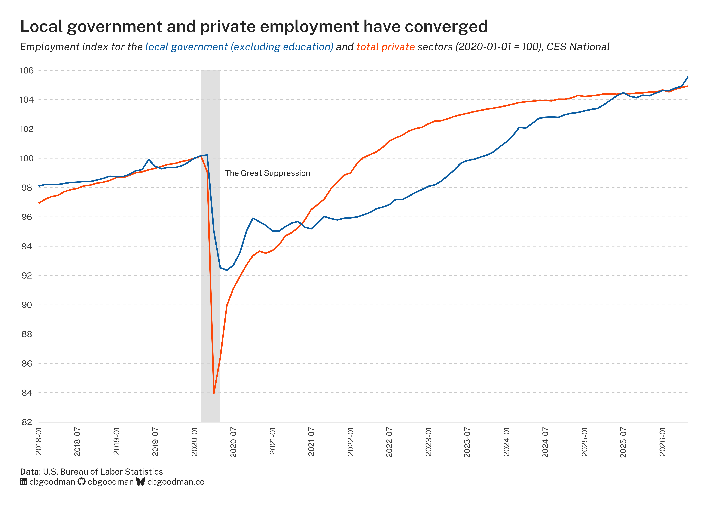

I have been generating this figure, more or less every month, for six years. It helps us understand "Is the local government sector growing similarly to the private sector?". 

::: {.column-body-outset}
{fig-alt="Local government and private employment have converged."}
:::

Why should we care about that?

If we were to pull back the timeline by a decade, a clear upward trend line would appear. When we are faced with a shock (COVID-19 in this example), we're often interested in how quickly, if ever, the series returns to the trend. We can interrogate that quite easily. The private sector (in orange) returns relatively quickly—in early 2023; however, the local government sector (in blue) lags significantly.

This, of course, begets more questions. Why did the local government sector lag? What are the consequences of this? Certainly, the answers differ on an individual organization level than on a sectoral level. And those answers are the topic of another post.

I love a figure that answers a question and makes you ask additional follow-ups.