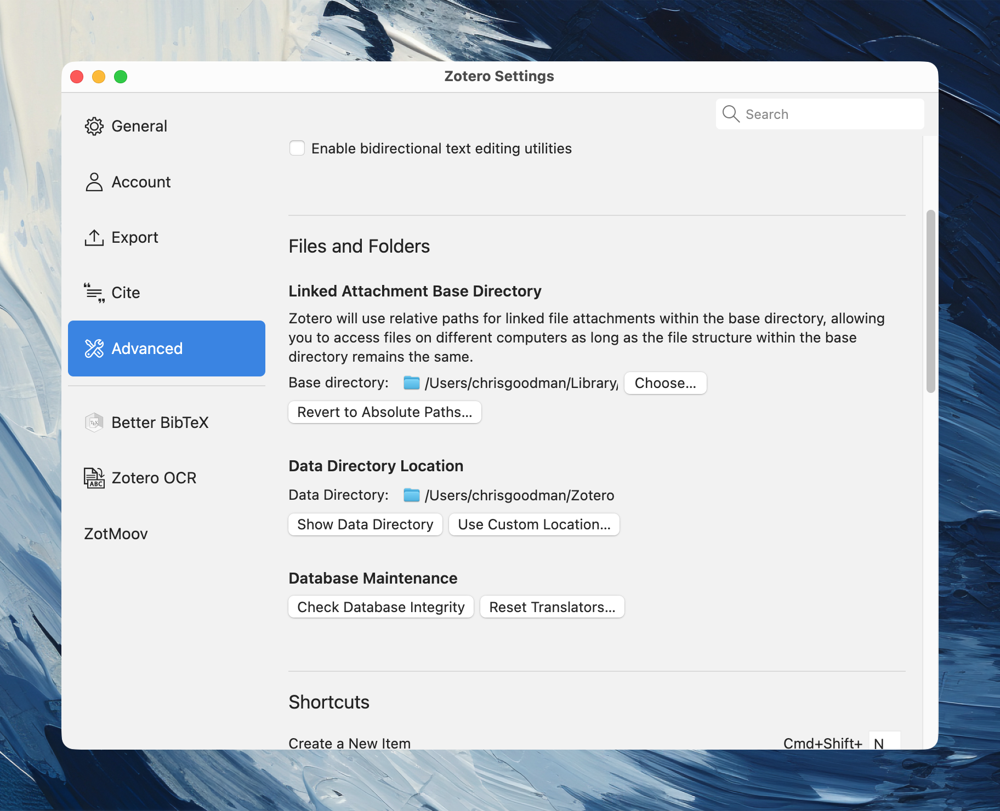
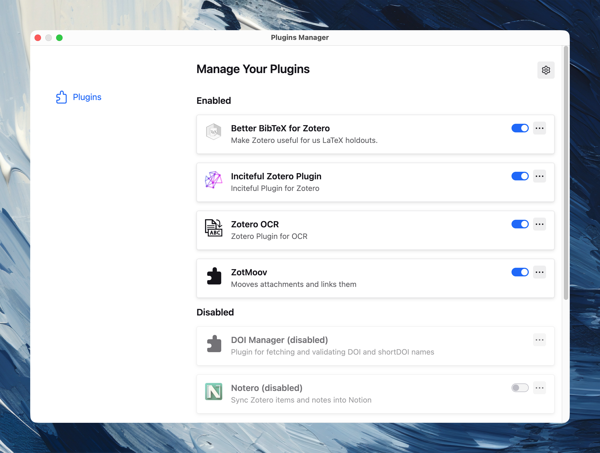
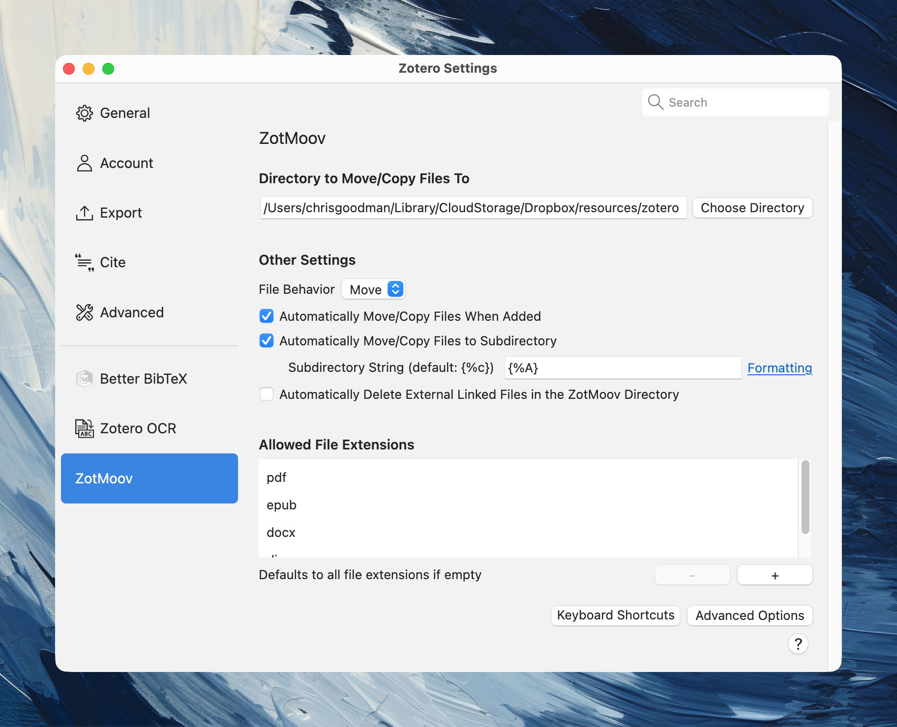

[Zotero](https://www.zotero.org) is free and open source reference management software. It is incredibly popular inside academia (and outside) for the management of bibliographic information. Zotero is quite capable out of the box; however, when customized, it is incredibly useful.

## Prerequisites

- [Zotero](https://www.zotero.org/download/), obviously
- Required plugins (more or less)
  - [Better BibTeX](https://retorque.re/zotero-better-bibtex/)
  - [ZotMoov](https://github.com/wileyyugioh/zotmoov)
  - [Zotero OCR](https://github.com/UB-Mannheim/zotero-ocr) (also requires Tesseract)
  - [Obsidian Zotero Integration](https://github.com/obsidian-community/obsidian-zotero-integration) (Optional but helpful)

## Basic Setup

Zotero will work more or less flawlessly right out of the box; however, if you do a little customization, it will work even better. The first thing you should do is [create an account](https://www.zotero.org/user/register) so that you can have your citations sync across computers or have access to them via mobile or web. There are also some advanced usages that require API access, and this is how you get that. 

You can choose to have attachments (PDF, EPUB, etc) sync to the cloud; however, the free storage is small and paid storage is expensive. There's a better way. Zotero allows users to separate the main data directory (that contains all the metadata for citations) from the attachments database. I leave the data directory in its default location (no need to manually sync this because we're uploading it to the web via Zotero). On a Mac, this is your root user folder. I choose to put the attachments directory in a folder in Dropbox; however, you can put this with any cloud service you like if syncing is important. Or, you can put it where you like on your computer. The important part is the two databases are separate, so Zotero won't try to upload your attachments to the web.

I use a plugin to manage the attachments database. Zotero's default way of doing this is impossible to decipher as a human. So, onto customizing Zotero.

## Plugins
### Installing Plugins

In addition to the main software, Zotero is capable of using community plugins to extend the capabilities of the software. I contend that two are essential, Better BibTex and ZotMoov (linked above). To install these, download the relevant `.xpi` file from the sources above, go to the Tools → Plugins, and drag the `.xpi` file into the window.

### Configuring & Using Plugins

Better BibTex is essential for generating BibTex-style citation keys that are used by myriad other programs to pull in citations (Quarto, Obsidian, etc). For our purposes, this is more or less auto-configured out of the box. I have never found a huge need to do much customization here. It just works.

ZotMoov is essential for solving the impossible-to-decipher attachment naming scheme that Zotero uses by default. The important configuration here is to make the Move/Copy directory the same as the attachments database location. You can select various other settings to streamline things. I have it configured to move new attachments automatically when added and to move them into subfolders based on the last name of the first author. PDFs are named "Author - Year - Title.pdf". This makes looking for a PDF outside of Zotero, a thing I do for class readings fairly often, much easier. 

An additional plugin that's useful to me with older or scanned PDFs is Zotero OCR. This uses the `tesseract` package to OCR PDFs. I have found the accuracy to be quite good, much better than it once was. There's very little configuration necessary here; however, you will need to install `tesseract` and `pdftoppm` and tell the plugin where those files are located on your computer. 

## Connections to other software

Briefly,

- RStudio and Positron can use your local Zotero data directory to pull in citations to be used with Quarto. This works automatically with zero configuration; however, you do need both programs (RStudio/Positron and Zotero) open and use the visual editor for this to work. More information [here](https://quarto.org/docs/tools/positron/visual-editor.html#zotero-citations).

- There is an integration between Zotero and Obsidian. I use this to keep track of all my notes (which I take natively in Zotero and export to Obsidian). This requires Better BibTex to work. See the Obsidian Zotero Integration [documentation](https://github.com/obsidian-community/obsidian-zotero-integration) for more details.

## Takeaways

That's my setup. I have, what I think is, a large database (~1700 citations). This allows me to interact with them in a way that's useful for my processes with little friction. Hopefully some of this is helpful.